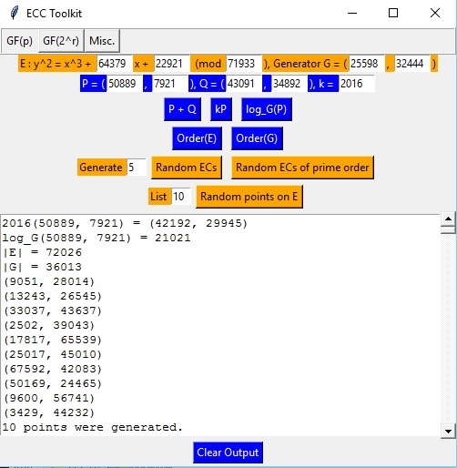
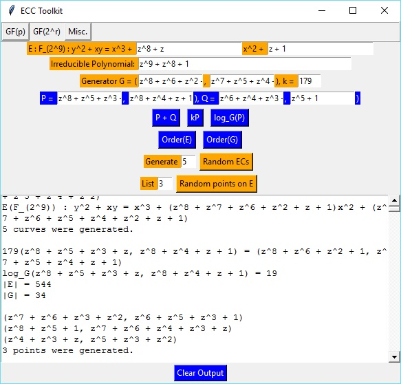
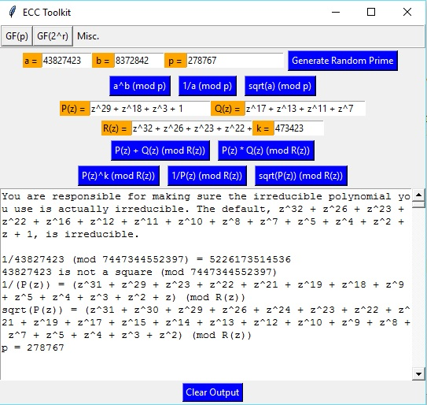

# Elliptic Curve Cryptography (ECC) Toolkit

Elliptic Curve Cryptography (ECC) Toolkit  
Last Updated: July 21, 2016  
Author: Aaron Blumenfeld

## ABOUT:

This is a basic Python TkInter application to implement the most commonly
used computations in elliptic curve cryptography. It is intended to be
used for instructive purposes (by students or educators) studying
cryptography. Arbitrarily large fields are supported, but some functions
are quite slow. In particular, computing the order and computing random
points in the GF(2^r) tab is quite slow. In the prime case, we can compute
x^3 + ax + b for each x and see if that number is a square. If so, we can take
the square root to find points. But in the binary case, computing x^3 + ax^2 + b
gives us y^2 + xy, not just y^2, so we cannot simply compute a square root.
There are more advanced algorithms for computing orders more efficiently,
but I have not implemented them.

Logarithms may also be slow because a brute-force method is used. At some
point, I may implement Pollard-Rho for a speed-up. I did implement a variant
of Pollard-Rho for factoring integers, though. This is used for finding the order
of a point in the prime case: first find the order of the curve, then check
all factors of that order to find the order of a point. I did not use factorization
for finding the order of a point for the binary case, though, because finding the order
of a curve over GF(2^r) is quite inefficient. I simply used the upper bound q + 2sqrt(q)
as an upper bound on the order and did a linear brute-force search (where q = 2^r).
This upper bound is implied by Hasse's Theorem.

For binary elliptic curves, you need to make sure the irreducible polynomial you
use is actually irreducible. The default, z^9 + z^8 + 1, is irreducible. You can
see the Java version (github.com/ablumenf/ECC) for a drop-down menu of irreducible
polynomials. All irreducible polynomials mod 2 up to degree 10 are listed there.

A discrete logarithm of -1 indicates an error. This means that there is
no solution. For example, if you choose a non-cyclic elliptic curve group
and want to solve kG = P, where G generates a proper subgroup of E and P
lies in a different coset, there will be no solution.

I did not implement error detection for trying to do point arithmetic when
the point is not on the curve. Perhaps it can be instructive to see what
happens with the calculations in this situation.

There is also a Misc. tab, which includes support for exponentiation, inverses,
and square roots (mod p), as well as addition, multiplication, inverses, 
exponentiation, and square roots of polynomials in finite fields.

When you enter a value in the GF(p) tab (other than the modulus, k, and n), it
automatically gets reduced mod p. Similarly, when you enter a polynomial in
the GF(2^r) and Misc. tabs, it automatically gets reduced mod the irreducible
polynomial and R(z), respectively.

## SOURCE FILES:

- BinaryEllipticCurve.py: A class that implements elliptic curves over binary fields, including logarithms, orders, as well as lists of points. Also a static method for listing elliptic curves.
- ECC.py: The driver for the GUI application.
- ECMath.py: Various static methods with implementations of mathematical functions (modular exponentiation, inverses, square roots, primality testing, etc.)
- EllipticCurve.py: A class that implements elliptic curves, including logarithms, orders, as well as lists of points. Also a static method for listing elliptic curves.
- Point.py: A class that implements points. 3D points are used for projective coordinates, but they're only printed as 2D points. Point addition and multiplication are implemented here.
- Polynomial.py: A class that implements (sparse) Polynomials mod 2 using sets.
- PolynomialPoint.py: A class that implements polynomial points. 3D points are used for LD projective coordinates, but they're only printed as 2D points. Point addition and multiplication are implemented here.
- TabbedGUI.py: A class that implements all the GUI details (Tab class, as well as the details for each of the tabs GF(p), GF(2^r), and Misc.).